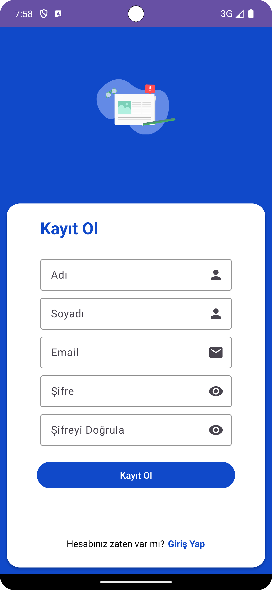
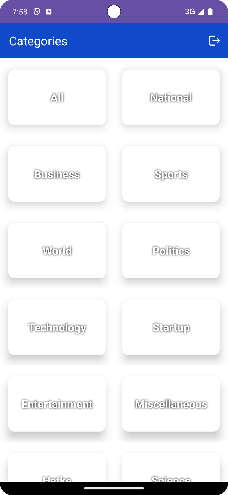
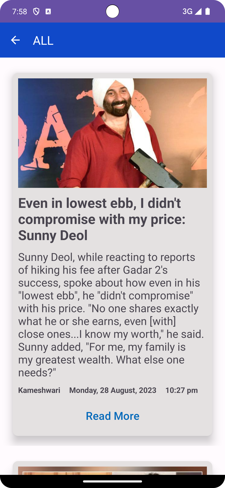

# Kotlin News App

A simple app that I created with **Kotlin and Android**.

## Getting Started

User login and registration are done through the room database. After adding a record with room database on your device, you can log in to the application. After logging into the application, it is necessary to enter data for the Categories database. You can add categories with the instructions in the Readme.md file. After the categories are added, you can click on the categories you want to reach the relevant current news. Click the Read More button.

## API

This project developed using https://github.com/cyberboysumanjay/Inshorts-News-API .

## Tech Stack

- MVVM
- Fragment Navigation
- Room Database
- Dagger Hilt
- Coil
- Retrofit
- Lottie Animation
- Material UI Design

### Installation

Clone the repo
   ```sh
   git clone https://github.com/busraustunel/KotlinNewsApp.git
   ```

### Requirements

  * navigation
  ```sh
  implementation ("androidx.navigation:navigation-fragment-ktx:2.7.0")
  implementation ("androidx.navigation:navigation-ui-ktx:2.7.0")
  ```

  * room
  ```sh
  implementation ("androidx.room:room-common:2.6.0-alpha02")
  implementation ("androidx.room:room-runtime:2.6.0-alpha02")
  annotationProcessor ("androidx.room:room-compiler:2.6.0-alpha02")
  implementation ("androidx.room:room-ktx:2.6.0-alpha02")
  kapt ("androidx.room:room-compiler:2.6.0-alpha02")
  ```

  * hilt
  ```sh
  implementation ("com.google.dagger:hilt-android:2.47")
  kapt ("com.google.dagger:hilt-compiler:2.47")
  ```

  * coil
  ```sh
  implementation("io.coil-kt:coil:2.4.0")
  ```

   * retrofit
  ```sh
  implementation("com.squareup.retrofit2:retrofit:2.9.0")
  implementation ("com.squareup.retrofit2:converter-gson:2.9.0")
  ```

## Usage

- Add Categories to Room Database
   ```sh
   INSERT INTO Category (name, value)
    VALUES
    ('All', 'all'),
    ('National', 'national'),
    ('Business', 'business'),
    ('Sports', 'sports'),
    ('World', 'world'),
    ('Politics', 'politics'),
    ('Technology', 'technology'),
    ('Startup', 'startup'),
    ('Entertainment', 'entertainment'),
    ('Miscellaneous', 'miscellaneous'),
    ('Hatke', 'hatke'),
    ('Science', 'science'),
    ('Automobile', 'automobile');
    ```

## Screenshoots

<table>
  <tr>
    <td>Login</td>
     <td>Register</td>
     <td>Categories</td>
     <td>News</td>
     <td>Read More</td>
  <tr>
    <td></td>
    <td></td>
    <td></td>
     <td></td>
    <td></td>
 </table>


